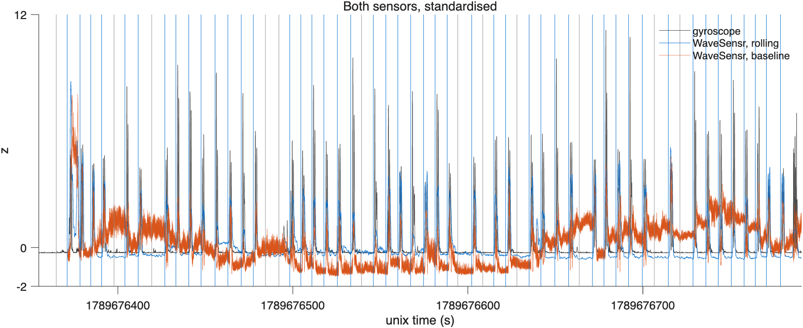

# WaveSensr — movement from Wi-Fi

A browser app that runs entirely on this Mac. Two ESP32-S3 boards (esp-csi `csi_send` /
`csi_recv`) measure Wi-Fi Channel State Information; WaveSensr streams it live, shows every
slice like an EEG recorder, and records it to CSV. It never shows simulated data: without
the boards, Live says so and shows the setup instead.

**Validated against a head-worn gyroscope** (pilot, 17 Sep 2026, n = 1, the author): 59 cued trials (48 head movements, 11 still), detection AUC 1.00 for both sensors, 100% hits, 9% false alarms, unchanged when the Wi-Fi stream is thinned from 70 Hz to 3 Hz. Movements were large (100–200 °/s), so this is a ceiling, not a limit. Data, analysis and figures: [`validation/pilot_2026-09-17`](validation/pilot_2026-09-17/).



```bash
/usr/bin/python3 server.py        # receiver on USB, then open http://localhost:8777
```

Python stdlib only (`/usr/bin/python3` has pyserial). Nothing leaves the machine.

## Setup

Boards upright on stands at eye height, antennas up, chip sides facing each other,
100–120 cm apart (antenna to antenna), participant's head centred between them. Enter the
measured distance in Setup; recording needs it. The "Live data not available" screen has a
3D figure of this (click a board to see its orientation).

## Using it

- **Live**: Start / Record. Show **Raw** (dB, fixed colour range), **Rolling** (change from each
  slice's rolling average, 1–10 s) or **Baseline** (change from the latest Baseline recording).
  Lines or heatmap, time window, slices per page, scale.
- **Calibrate**: 3-minute resting baseline after a 10 s countdown, saved as "Baseline".
  The MATLAB version for studies is `validation/wavesensr_baseline.m`.
- **Past**: play any recording in the page — pause, seek, ±5 s, 0.5–4×.

## Files

Each recording is two files in the chosen folder (Setup → Save recordings to):

- `WS_<yyyymmdd>_<hhmmss>.csv` — `unix_time, s1…sN`: one row per packet, |CSI| per slice
  (HT-LTF only, s1 = lowest frequency). Raw: nothing averaged or subtracted.
- `WS_<yyyymmdd>_<hhmmss>.json` — label, note, start/end, packet rate, slice count, board
  distance. Renaming a recording in the app updates this, not the file name.

Sessions are indexed in `data/vitals.db`; settings in `data/settings.json`.

## Sources

```bash
/usr/bin/python3 server.py --source serial --port /dev/tty.usbmodem1101   # ESP32 receiver
/usr/bin/python3 server.py --source udp --bind 0.0.0.0:5566               # CSI over the network
```

## Code

- `server.py` — capture, SSE stream (10 Hz), recording, API
- `static/js/core.js` — buffers, drawing, display modes · `live.js` — status, recording, panels ·
  `calibration.js` · `player.js`
- `static/setup3d.js` — the setup figure. Vendored in `static/vendor/`: three.js r160 and the
  X Bot mannequin (MIT), Poly Haven's Wooden Table 02 and School Chair 01 (CC0)
